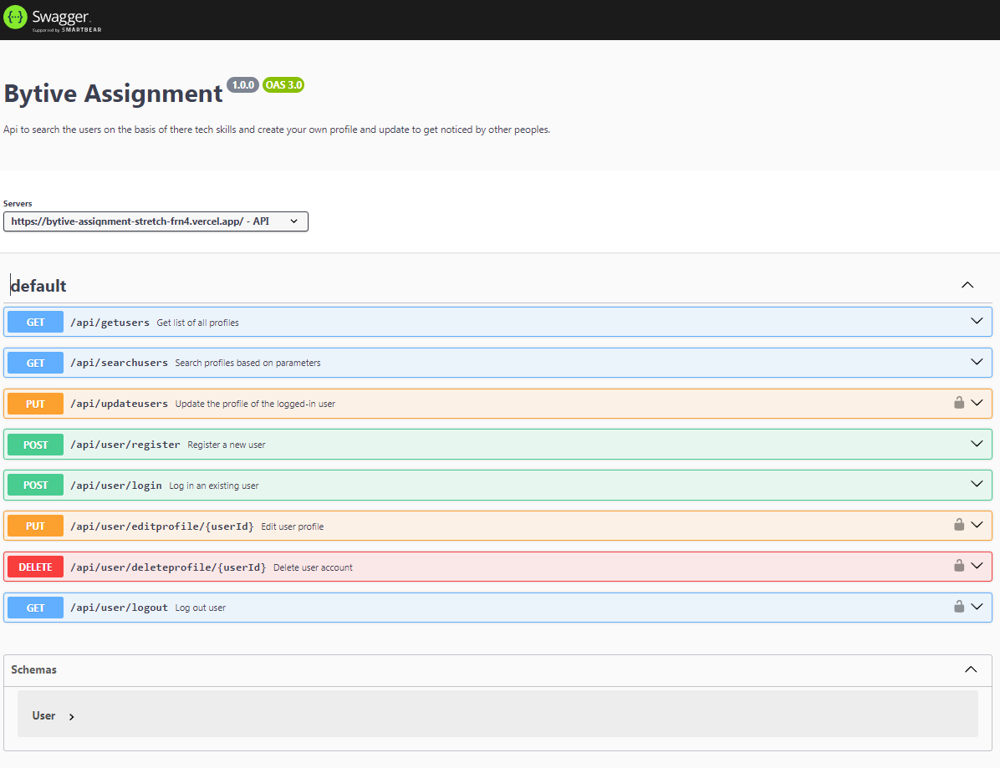

# Bytive_assignment_stretch
# Bytive Backend Documentation

Welcome to the backend documentation for the Bytive application. This documentation provides information about the API endpoints, authentication, and usage instructions.

## Table of Contents

- [API Screenshots](#api-screenshots)
- [Getting Started](#getting-started)
- [Authentication](#authentication)
- [Endpoints](#endpoints)
  - [1. Fetch User Profiles](#1-fetch-user-profiles)
  - [2. Search Profiles](#2-search-profiles)
  - [3. Update User Profile](#3-update-user-profile)
  - [4. User Registration](#4-user-registration)
  - [5. User Login](#5-user-login)
  - [6. Edit User Profile](#6-edit-user-profile)
  - [7. Delete User Account](#7-delete-user-account)
  - [8. Logout User](#8-logout-user)

## API Screenshots

Here are some screenshots demonstrating the usage of the API.



*Figure 1: Fetching user profiles from the API.*


*Figure 2: Searching profiles based on parameters.*


*Figure 3: Updating the profile of the logged-in user.*

*(Note: These screenshots are illustrative and may not represent the exact UI or responses in your implementation.)*

## Getting Started

To get started with the Bytive API, follow these steps:

1. Clone the repository: `git clone https://github.com/your-username/bytive-backend.git`
2. Install dependencies: `npm install`
3. Configure environment variables: Create a `.env` file and configure the necessary variables (e.g., database connection, secret keys).

## Authentication

The API uses JSON Web Tokens (JWT) for authentication. To access protected routes, include the JWT token in the `Authorization` header of your requests.

Example:

```http
GET /api/getusers
Authorization: YOUR_JWT_TOKEN
```